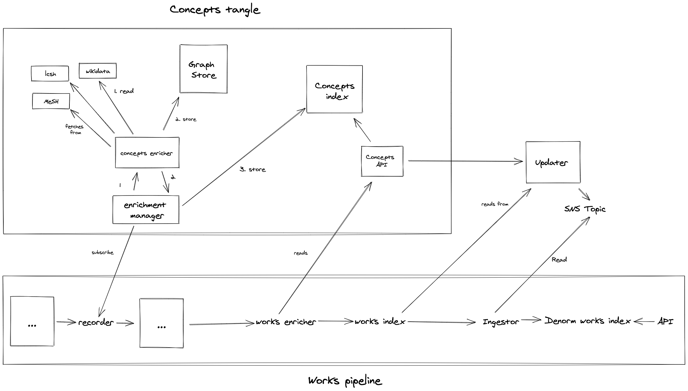

# Concepts

Looking into concepts within the catalogue API.

Working towards something like this:



## Populating the graph store with enriched concepts

```
make run
```

This starts up:

- an enricher API, which takes identifiers from known controlled vocabularies and returns additional information (variant names, etc)
- a little ETL pipeline from an ES index to a graph store in neo4j aura. if concepts in the ES index contain identifiers from our set of known controlled vocabularies, they're enriched by the API

For now, this just bootstraps the graph store from the existing concepts index in the reporting elasticsearch cluster, ie it doesn't work off any of the real pipeline topics/queues.

## Graph structure

More detail on the internal structure of the graph store [here](graph_structure.md).
