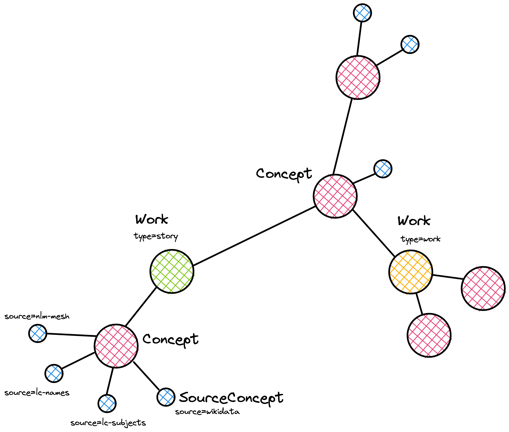

# Graph Structure

The graph is composed of nodes and relationships, as illustrated in the figure above.

The types are more precisely defined in `neomodel` in the [pipeline directory](/pipeline/), but a basic overview is provided here.

## Nodes

Three major types of node exist:

- **Work**, with two variants
  - `type=work` from the collection <https://wellcomecollection.org/collections>
  - `type=story` from the published editorial pieces <https://wellcomecollection.org/stories>
- **Concept**, with two variants
  - `type=person` for contributors to works
  - `type=concept` for anything else
- **SourceConcept**, the data about the concept from one of four sources
  - `source_type=wikidata` for concepts from Wikidata
  - `source_type=nlm-mesh` for concepts from MeSH (Medical Subject Headings)
  - `source_type=lc-subjects` for concepts from LCSH (Library of Congress Subject Headings)
  - `source_type=lc-names` for concepts from LC Names (Library of Congress Name Authority File)

## Relationships

- **HAS_CONCEPT**, from a work to a concept
- **HAS_SOURCE_CONCEPT**, from a concept to a source concept
- **CONTRIBUTED_TO**, from a person-type concept to a work
- **HAS_NEIGHBOUR**, from a concept to another concept
